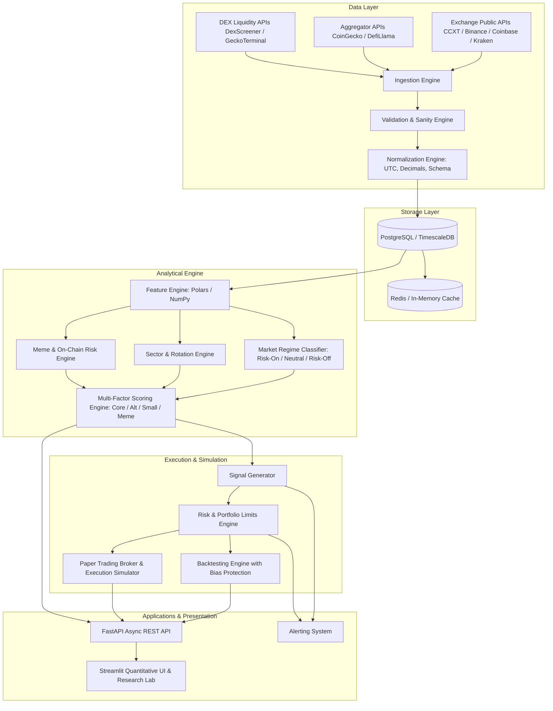
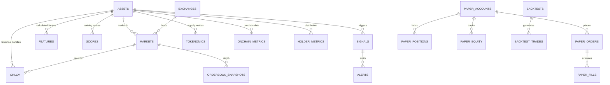

# Crypto Intelligence, Market Scanner, Backtesting & Paper Trading Platform
## Master Architecture & Engineering Specification

---

### Executive Summary

This platform is a production-grade, multi-factor quantitative research and paper-trading laboratory designed for cryptocurrency markets. It rejects naive "price up → buy" heuristics in favor of rigorous statistical factor models, market regime classification, point-in-time survivorship bias prevention, explainable scoring, realistic execution simulation (incorporating spreads, market impact, slippage, and tiered fees), and an auditable paper-trading portfolio.

The system is strictly non-custodial and operates in **research, backtesting, and paper-trading mode**. Real-money execution is completely segregated behind disabled-by-default feature flags and interfaces.

---

## 1. Architecture Document & Data Pipeline

The platform is architected around a unidirectional data-processing pipeline with strict point-in-time state immutability:



### End-to-End Pipeline Stages

1. **Ingestion**: Asynchronous, rate-limited collectors poll raw OHLCV candles, tickers, order book depths, funding rates, open interest, on-chain metrics, and tokenomics.
2. **Validation**: Enforces integrity checks (no negative prices, no high < low, no duplicate candles, no future timestamps, volume anomaly detection). Invalid records are tagged with status: `GOOD`, `WARNING`, or `INVALID` and quarantined.
3. **Normalization**: Timestamps coerced strictly to UTC Unix millisecond timestamps; symbols mapped to a standardized global asset registry (e.g., `BTC/USDT` on Binance maps to canonical `asset_id: BTC`).
4. **Feature Extraction**: High-throughput vectorized computation in Polars/NumPy calculating rolling multi-horizon momentum, volatility, ATR, relative strength against BTC/ETH benchmarks, liquidity turnover, and trend indicators.
5. **Market Regime Classification**: Macro regime filter evaluating BTC trend, market-wide breadth, aggregate funding rate, and volatility regime to classify current market state as `RISK_ON`, `NEUTRAL`, or `RISK_OFF`.
6. **Asset Classification**: Dynamic partitioning of the asset universe into `CORE` (BTC, ETH), `ALTCOIN_LARGE`, `MID_CAP`, `SMALL_CAP`, `MEME`, and specific sectors (L1, L2, DeFi, AI, DePIN, RWA).
7. **Multi-Factor Scoring**: Separate factor weighting models for each asset class, computing explainable sub-scores (0-100) for Momentum, Relative Strength, Trend, Volume, Liquidity, Quality, and Risk.
8. **Risk Engine**: Validates all incoming candidate signals against portfolio concentration constraints, maximum allowable sector and meme exposure, max drawdown limits, and volatility-adjusted position sizing (Kelly/ATR).
9. **Backtesting / Paper Trading**:
   - **Backtester**: Simulates historical trading with point-in-time universe snapshots, eliminating look-ahead and survivorship bias, applying realistic fill models (spread + slippage + fees).
   - **Paper Trading Broker**: Simulates live order execution against incoming real-time market data without capital at risk, tracking full order lifecycle and margin/equity states.
10. **Journaling & Observability**: Every signal, order, fill, and portfolio snapshot is written to immutable audit tables with exact feature snapshots.

---

## 2. Repository Structure

```
crypto-intelligence/
├── apps/
│   ├── api/                            # FastAPI Application
│   │   ├── __init__.py
│   │   ├── main.py                     # ASGI entrypoint
│   │   ├── deps.py                     # Dependency injection (DB, Redis, settings)
│   │   └── routes/
│   │       ├── health.py
│   │       ├── assets.py
│   │       ├── scanner.py
│   │       ├── scores.py
│   │       ├── sectors.py
│   │       ├── regime.py
│   │       ├── paper.py
│   │       ├── backtest.py
│   │       └── alerts.py
│   └── dashboard/                      # Streamlit Application
│       ├── app.py                      # Multi-page coordinator & theme config
│       ├── components/                 # Reusable UI widgets, cards, charts
│       │   ├── cards.py
│       │   ├── charts.py
│       │   └── filters.py
│       └── views/                      # Dashboard pages
│           ├── 1_Overview.py
│           ├── 2_Market_Scanner.py
│           ├── 3_Meme_Radar.py
│           ├── 4_Sectors_Rotation.py
│           ├── 5_Coin_Detail.py
│           ├── 6_Paper_Portfolio.py
│           ├── 7_Backtest_Lab.py
│           └── 8_Alert_Center.py
│
├── src/                                # Core Domain Library
│   ├── __init__.py
│   ├── config/                         # Configuration & Settings
│   │   ├── __init__.py
│   │   ├── settings.py                 # Pydantic v2 BaseSettings (.env driven)
│   │   └── constants.py
│   ├── database/                       # Database models & connection management
│   │   ├── __init__.py
│   │   ├── session.py                  # Async SQLAlchemy 2.0 session factory
│   │   ├── models/                     # Declarative ORM models
│   │   │   ├── asset.py
│   │   │   ├── market_data.py
│   │   │   ├── features.py
│   │   │   ├── scoring.py
│   │   │   ├── paper.py
│   │   │   ├── backtest.py
│   │   │   └── alert.py
│   │   └── migrations/                 # Alembic migration scripts
│   ├── ingestion/                      # Data Ingestion Engine
│   │   ├── __init__.py
│   │   ├── scheduler.py                # Async scheduling orchestrator
│   │   ├── providers/                  # Data Provider Adapters (Interface-based)
│   │   │   ├── base.py                 # BaseDataProvider abstract class
│   │   │   ├── ccxt_provider.py        # CCXT public exchange client
│   │   │   ├── coingecko_provider.py   # CoinGecko public market API client
│   │   │   ├── defillama_provider.py   # DefiLlama on-chain & TVL client
│   │   │   └── dexscreener_provider.py # DexScreener DEX/Meme client
│   ├── validation/                     # Data Quality & Validation Engine
│   │   ├── __init__.py
│   │   ├── ohlcv_validator.py          # Candle integrity, timestamp checks
│   │   └── anomaly_detector.py         # Volume spikes, flash crashes, zero price
│   ├── normalization/                  # Canonical schema mapping & UTC coercing
│   │   ├── __init__.py
│   │   └── normalizer.py
│   ├── features/                       # Quantitative Feature Calculations
│   │   ├── __init__.py
│   │   ├── momentum.py                 # Multi-period returns & acceleration
│   │   ├── relative_strength.py        # Alpha against BTC, ETH, sectors
│   │   ├── trend.py                    # EMAs, ADX, MACD, slopes
│   │   ├── volume.py                   # Volume anomalies, turnover ratio
│   │   ├── volatility.py               # Realized vol, ATR, downside deviation
│   │   ├── liquidity.py                # Bid-ask spread, depth, slippage proxy
│   │   ├── market_regime.py            # Regime classifier (Risk-On/Neutral/Risk-Off)
│   │   └── sector.py                   # Sector aggregations & rotation
│   ├── scoring/                        # Multi-Factor Scoring Engine
│   │   ├── __init__.py
│   │   ├── base.py                     # Base scoring engine & explainability
│   │   ├── core.py                     # BTC/ETH scoring model
│   │   ├── altcoin.py                  # Mid/Large-cap altcoin model
│   │   ├── smallcap.py                 # Small-cap model
│   │   └── meme.py                     # Meme coin & on-chain risk model
│   ├── risk/                           # Risk Management & Limits Engine
│   │   ├── __init__.py
│   │   ├── limits.py                   # Position & portfolio exposure checks
│   │   ├── sizing.py                   # Volatility/Kelly position sizing
│   │   ├── exposure.py                 # Sector/Meme concentration guardrails
│   │   └── drawdown.py                 # Max portfolio & daily drawdown circuits
│   ├── backtesting/                    # Backtest Engine
│   │   ├── __init__.py
│   │   ├── engine.py                   # Event-driven and vectorized backtest coordinator
│   │   ├── universe.py                 # Point-in-time survivorship universe manager
│   │   ├── execution.py                # Realistic execution & order simulation
│   │   ├── fees.py                     # Exchange fee tier modeling
│   │   ├── slippage.py                 # Quadratic / volume-share slippage models
│   │   ├── metrics.py                  # Sharpe, Sortino, Calmar, MaxDD, WinRate
│   │   └── walk_forward.py             # Anchored & rolling walk-forward validator
│   ├── paper/                          # Paper Trading Engine
│   │   ├── __init__.py
│   │   ├── broker.py                   # Virtual Broker implementation
│   │   ├── orders.py                   # Market, Limit, Stop, Take-Profit orders
│   │   ├── fills.py                    # Real-time fill simulator
│   │   ├── portfolio.py                # Balance, equity, margin tracking
│   │   └── reconciliation.py           # Portfolio balance reconciliation
│   ├── meme/                           # Specialized Meme Intelligence
│   │   ├── __init__.py
│   │   ├── pipeline.py                 # Meme scanner & risk aggregator
│   │   └── flags.py                    # Honeypot, concentration, age risk flags
│   ├── tokenomics/                     # Tokenomics & Unlock Engine
│   │   ├── __init__.py
│   │   └── unlocks.py                  # FDV ratios, inflation, vesting trackers
│   ├── onchain/                        # On-Chain Metric Integrations
│   │   ├── __init__.py
│   │   └── metrics.py                  # TVL, active addresses, transfer volume
│   ├── alerts/                         # Real-time Alerting Engine
│   │   ├── __init__.py
│   │   └── manager.py                  # Threshold monitors & webhook dispatchers
│   └── utils/                          # Cross-cutting utilities
│       ├── __init__.py
│       ├── logging.py                  # Structured JSON logging (structlog)
│       ├── time.py                     # UTC datetime & Unix timestamp helpers
│       └── math.py                     # Quant mathematical helpers
│
├── tests/                              # Comprehensive Test Suite
│   ├── conftest.py                     # Shared fixtures, mock providers, DB setup
│   ├── unit/                           # Isolated unit tests
│   │   ├── test_features.py
│   │   ├── test_scoring.py
│   │   ├── test_risk_limits.py
│   │   ├── test_fees_slippage.py
│   │   ├── test_order_execution.py
│   │   └── test_portfolio_accounting.py
│   ├── bias/                           # Bias-specific test suites
│   │   ├── test_lookahead_bias.py      # Automated future leakage verification
│   │   └── test_survivorship_bias.py   # Historical universe point-in-time checks
│   └── integration/                    # End-to-end integration tests
│       ├── test_ingestion_pipeline.py
│       ├── test_paper_trading.py
│       └── test_api_endpoints.py
│
├── configs/                            # Configuration files
│   ├── default_config.yaml             # Base platform parameters & weights
│   └── exchanges.yaml                  # Exchange connection specifications
├── docker/                             # Dockerfiles & container configs
│   ├── Dockerfile.api
│   ├── Dockerfile.dashboard
│   └── Dockerfile.worker
├── docker-compose.yml                  # Complete infrastructure orchestration
├── pyproject.toml                      # Project metadata & dependency specification
├── .env.example                        # Template environment variables
└── README.md                           # Documentation & quickstart guide
```

---

## 3. Technology Decisions & Rationale

| Layer | Selected Tech | Rationale | Alternatives Considered |
|---|---|---|---|
| **Language Runtime** | Python 3.12+ | Native async speedups, typing improvements, broad quantitative library support. | Python 3.10/3.11, Rust (used as PyO3 extensions if needed). |
| **Data Processing** | Polars + NumPy | 10x-50x faster than Pandas for time-series rolling calculations; zero-copy Apache Arrow memory model; strict null semantics. | Pandas (retained solely for legacy interoperability). |
| **Database ORM & DB** | PostgreSQL 16 + TimescaleDB extension / SQLAlchemy 2.0 Async + asyncpg | Gold standard for financial time-series. Hypertables provide automated temporal partitioning, compression, and high write throughput. Dual support: fallback to SQLite async (`aiosqlite`) for zero-external-dependency local testing. | MongoDB (lacks relational integrity), DuckDB (file-only, concurrency issues in multi-service web). |
| **Cache & State** | Redis 7+ / In-Memory Fallback | Millisecond latency for order book snapshots, rate-limit token buckets, and live tickers. In-memory dictionary fallback enables standalone operation. | Memcached (no complex data structures). |
| **Web API** | FastAPI + Pydantic v2 | High-performance asynchronous REST framework, automatic OpenAPI documentation, strict request/response data validation via C-speed Rust core (Pydantic-core). | Flask / Django REST Framework (slower, synchronous legacy). |
| **Frontend V1** | Streamlit + Plotly | Rapid prototyping of high-density quantitative financial dashboards without frontend build bloat; native Python chart integration with Plotly. | Next.js + React (designated for V2 once research engine is fully hardened). |
| **Exchange Connectivity**| CCXT (Async) | Unified API across 100+ cryptocurrency exchanges; handles rate limits, nonce generation, and error mapping cleanly with public endpoints. | Direct REST/WebSocket implementations (high maintenance). |
| **Code Quality & Testing**| Ruff + Pytest + Pytest-Asyncio | Ruff replaces flake8, black, isort at 100x speed; pytest provides mature async fixture lifecycles. | Black/Flake8. |

---

## 4. Database ERD & Schema Specification

The database contains 26 core tables organized by domain. TimescaleDB hypertables are specified for high-frequency time-series tables (`ohlcv`, `trades`, `orderbook_snapshots`, `features`, `paper_equity`).



### Table Definitions & Primary Keys

1. **`assets`**: Canonical asset master table
   - `id` (VARCHAR(32), PK, e.g. `'BTC'`)
   - `name` (VARCHAR(128))
   - `symbol` (VARCHAR(32), indexed)
   - `asset_class` (VARCHAR(32), e.g. `'CORE'`, `'ALTCOIN'`, `'SMALL_CAP'`, `'MEME'`)
   - `primary_sector` (VARCHAR(64), indexed)
   - `coingecko_id` (VARCHAR(64), nullable)
   - `contract_address` (VARCHAR(128), nullable)
   - `chain` (VARCHAR(32), nullable)
   - `is_active` (BOOLEAN, default TRUE)
   - `created_at` (TIMESTAMPTZ, UTC)

2. **`asset_categories`**: Many-to-many asset category mapping
   - `asset_id` (VARCHAR(32), FK `assets.id`)
   - `category` (VARCHAR(64), e.g. `'DEFI'`, `'L1'`, `'AI'`, `'RWA'`)
   - Composite PK: `(asset_id, category)`

3. **`exchanges`**: Supported trading venues
   - `id` (VARCHAR(32), PK, e.g. `'binance'`, `'coinbase'`)
   - `name` (VARCHAR(64))
   - `is_dex` (BOOLEAN, default FALSE)
   - `is_active` (BOOLEAN, default TRUE)

4. **`markets`**: Tradable pairs on specific exchanges
   - `id` (VARCHAR(64), PK, e.g. `'binance:BTC/USDT'`)
   - `exchange_id` (VARCHAR(32), FK `exchanges.id`)
   - `asset_id` (VARCHAR(32), FK `assets.id`)
   - `quote_asset` (VARCHAR(16), e.g. `'USDT'`, `'USD'`)
   - `symbol` (VARCHAR(32), e.g. `'BTC/USDT'`)
   - `is_active` (BOOLEAN, default TRUE)

5. **`ohlcv`**: Candlestick time-series (TimescaleDB Hypertable on `time`)
   - `time` (TIMESTAMPTZ, UTC, NOT NULL)
   - `market_id` (VARCHAR(64), FK `markets.id`, NOT NULL)
   - `timeframe` (VARCHAR(8), NOT NULL, e.g. `'5m'`, `'1h'`, `'1d'`)
   - `open` (DOUBLE PRECISION, NOT NULL)
   - `high` (DOUBLE PRECISION, NOT NULL)
   - `low` (DOUBLE PRECISION, NOT NULL)
   - `close` (DOUBLE PRECISION, NOT NULL)
   - `volume` (DOUBLE PRECISION, NOT NULL)
   - `quote_volume` (DOUBLE PRECISION, nullable)
   - `validation_status` (VARCHAR(16), default `'GOOD'`)
   - Composite PK: `(time, market_id, timeframe)`
   - Indexes: `(market_id, timeframe, time DESC)`

6. **`trades`**: Normalized public tick trades (optional high-frequency storage)
   - `time` (TIMESTAMPTZ, UTC, NOT NULL)
   - `market_id` (VARCHAR(64), NOT NULL)
   - `trade_id` (VARCHAR(64))
   - `side` (VARCHAR(8))
   - `price` (DOUBLE PRECISION)
   - `amount` (DOUBLE PRECISION)
   - Composite PK: `(time, market_id, trade_id)`

7. **`orderbook_snapshots`**: Top-of-book depth & bid/ask spread
   - `time` (TIMESTAMPTZ, UTC, NOT NULL)
   - `market_id` (VARCHAR(64), NOT NULL)
   - `bid_price` (DOUBLE PRECISION)
   - `bid_qty` (DOUBLE PRECISION)
   - `ask_price` (DOUBLE PRECISION)
   - `ask_qty` (DOUBLE PRECISION)
   - `spread_bps` (DOUBLE PRECISION)
   - `depth_2pct_bid_usd` (DOUBLE PRECISION)
   - `depth_2pct_ask_usd` (DOUBLE PRECISION)
   - Composite PK: `(time, market_id)`

8. **`funding_rates`**: Perpetual futures funding rates
   - `time` (TIMESTAMPTZ, UTC, NOT NULL)
   - `market_id` (VARCHAR(64), NOT NULL)
   - `rate` (DOUBLE PRECISION)
   - Composite PK: `(time, market_id)`

9. **`open_interest`**: Market-wide and exchange-specific open interest
   - `time` (TIMESTAMPTZ, UTC, NOT NULL)
   - `market_id` (VARCHAR(64), NOT NULL)
   - `open_interest` (DOUBLE PRECISION)
   - `open_interest_usd` (DOUBLE PRECISION)
   - Composite PK: `(time, market_id)`

10. **`liquidations`**: Normalized liquidation volume
    - `time` (TIMESTAMPTZ, UTC, NOT NULL)
    - `market_id` (VARCHAR(64), NOT NULL)
    - `long_liq_usd` (DOUBLE PRECISION)
    - `short_liq_usd` (DOUBLE PRECISION)
    - Composite PK: `(time, market_id)`

11. **`market_metrics`**: Aggregate market statistics
    - `time` (TIMESTAMPTZ, UTC, NOT NULL)
    - `total_market_cap_usd` (DOUBLE PRECISION)
    - `btc_dominance` (DOUBLE PRECISION)
    - `eth_dominance` (DOUBLE PRECISION)
    - `total_24h_volume_usd` (DOUBLE PRECISION)
    - `regime` (VARCHAR(16), `'RISK_ON'`, `'NEUTRAL'`, `'RISK_OFF'`)
    - Composite PK: `(time)`

12. **`onchain_metrics`**: Protocol fundamentals
    - `time` (TIMESTAMPTZ, UTC, NOT NULL)
    - `asset_id` (VARCHAR(32), FK `assets.id`)
    - `tvl_usd` (DOUBLE PRECISION, nullable)
    - `tvl_change_7d` (DOUBLE PRECISION, nullable)
    - `fees_24h_usd` (DOUBLE PRECISION, nullable)
    - `revenue_24h_usd` (DOUBLE PRECISION, nullable)
    - `active_addresses_24h` (INTEGER, nullable)
    - `tx_count_24h` (INTEGER, nullable)
    - Composite PK: `(time, asset_id)`

13. **`tokenomics`**: Circulating supply and unlock tracking
    - `asset_id` (VARCHAR(32), PK, FK `assets.id`)
    - `circulating_supply` (DOUBLE PRECISION)
    - `total_supply` (DOUBLE PRECISION)
    - `max_supply` (DOUBLE PRECISION, nullable)
    - `market_cap_usd` (DOUBLE PRECISION)
    - `fdv_usd` (DOUBLE PRECISION)
    - `fdv_to_market_cap_ratio` (DOUBLE PRECISION)
    - `next_unlock_date` (TIMESTAMPTZ, nullable)
    - `next_unlock_pct_of_circ` (DOUBLE PRECISION, nullable)
    - `updated_at` (TIMESTAMPTZ, UTC)

14. **`holder_metrics`**: Token concentration and growth (Meme / Small-Cap focus)
    - `time` (TIMESTAMPTZ, UTC, NOT NULL)
    - `asset_id` (VARCHAR(32), FK `assets.id`)
    - `holder_count` (INTEGER)
    - `holder_growth_24h_pct` (DOUBLE PRECISION)
    - `top_10_holders_pct` (DOUBLE PRECISION)
    - `whale_tx_count_24h` (INTEGER)
    - Composite PK: `(time, asset_id)`

15. **`social_metrics`**: Attention and developer metrics
    - `time` (TIMESTAMPTZ, UTC, NOT NULL)
    - `asset_id` (VARCHAR(32), FK `assets.id`)
    - `sentiment_score` (DOUBLE PRECISION, nullable)
    - `social_volume_24h` (DOUBLE PRECISION, nullable)
    - `developer_commits_30d` (INTEGER, nullable)
    - Composite PK: `(time, asset_id)`

16. **`features`**: Quantitative factor calculations (Hypertable on `time`)
    - `time` (TIMESTAMPTZ, UTC, NOT NULL)
    - `asset_id` (VARCHAR(32), FK `assets.id`, NOT NULL)
    - `timeframe` (VARCHAR(8), NOT NULL)
    - `return_1d` (DOUBLE PRECISION)
    - `return_7d` (DOUBLE PRECISION)
    - `return_30d` (DOUBLE PRECISION)
    - `return_90d` (DOUBLE PRECISION)
    - `momentum_acceleration` (DOUBLE PRECISION)
    - `volatility_adjusted_momentum` (DOUBLE PRECISION)
    - `rs_btc_30d` (DOUBLE PRECISION)
    - `rs_eth_30d` (DOUBLE PRECISION)
    - `rs_sector_30d` (DOUBLE PRECISION)
    - `ema20_ratio` (DOUBLE PRECISION)
    - `ema50_ratio` (DOUBLE PRECISION)
    - `ema200_ratio` (DOUBLE PRECISION)
    - `adx_14` (DOUBLE PRECISION)
    - `atr_14_pct` (DOUBLE PRECISION)
    - `volume_to_20d_avg` (DOUBLE PRECISION)
    - `realized_vol_30d` (DOUBLE PRECISION)
    - `downside_vol_30d` (DOUBLE PRECISION)
    - `max_drawdown_90d` (DOUBLE PRECISION)
    - `spread_est_bps` (DOUBLE PRECISION)
    - `turnover_ratio` (DOUBLE PRECISION)
    - Composite PK: `(time, asset_id, timeframe)`
    - Indexes: `(asset_id, timeframe, time DESC)`

17. **`scores`**: Explainable multi-factor scoring snapshots
    - `time` (TIMESTAMPTZ, UTC, NOT NULL)
    - `asset_id` (VARCHAR(32), FK `assets.id`, NOT NULL)
    - `model_type` (VARCHAR(32), NOT NULL, e.g. `'CORE'`, `'ALTCOIN'`, `'MEME'`)
    - `opportunity_score` (DOUBLE PRECISION, 0-100)
    - `quality_score` (DOUBLE PRECISION, 0-100)
    - `risk_score` (DOUBLE PRECISION, 0-100)
    - `trend_score` (DOUBLE PRECISION, 0-100)
    - `momentum_score` (DOUBLE PRECISION, 0-100)
    - `relative_strength_score` (DOUBLE PRECISION, 0-100)
    - `liquidity_score` (DOUBLE PRECISION, 0-100)
    - `breakdown_json` (JSONB, detailed factor additive terms)
    - `risk_flags` (TEXT[], e.g. `['HIGH_CONCENTRATION', 'LOW_LIQUIDITY']`)
    - Composite PK: `(time, asset_id, model_type)`

18. **`signals`**: Actionable research signals
    - `id` (VARCHAR(64), PK)
    - `time` (TIMESTAMPTZ, UTC, NOT NULL)
    - `asset_id` (VARCHAR(32), FK `assets.id`)
    - `signal_type` (VARCHAR(32), e.g. `'MOMENTUM_BREAKOUT'`, `'MEAN_REVERSION'`)
    - `direction` (VARCHAR(8), `'LONG'`, `'SHORT'`, `'NEUTRAL'`)
    - `score` (DOUBLE PRECISION)
    - `suggested_stop_loss_pct` (DOUBLE PRECISION)
    - `suggested_take_profit_pct` (DOUBLE PRECISION)
    - `feature_snapshot` (JSONB)
    - `is_active` (BOOLEAN, default TRUE)

19. **`paper_accounts`**: Simulated trading accounts
    - `id` (VARCHAR(32), PK, e.g. `'default_paper'`)
    - `name` (VARCHAR(64))
    - `base_currency` (VARCHAR(16), default `'USD'`)
    - `starting_balance` (DOUBLE PRECISION, default 100000.0)
    - `cash_balance` (DOUBLE PRECISION)
    - `created_at` (TIMESTAMPTZ, UTC)

20. **`paper_orders`**: Simulated order lifecycle
    - `id` (VARCHAR(64), PK)
    - `account_id` (VARCHAR(32), FK `paper_accounts.id`)
    - `asset_id` (VARCHAR(32), FK `assets.id`)
    - `exchange_id` (VARCHAR(32))
    - `order_type` (VARCHAR(16), `'MARKET'`, `'LIMIT'`, `'STOP_LOSS'`)
    - `side` (VARCHAR(8), `'BUY'`, `'SELL'`)
    - `quantity` (DOUBLE PRECISION)
    - `limit_price` (DOUBLE PRECISION, nullable)
    - `stop_price` (DOUBLE PRECISION, nullable)
    - `status` (VARCHAR(16), `'PENDING'`, `'FILLED'`, `'CANCELLED'`, `'REJECTED'`)
    - `created_at` (TIMESTAMPTZ, UTC)
    - `updated_at` (TIMESTAMPTZ, UTC)

21. **`paper_fills`**: Execution records
    - `id` (VARCHAR(64), PK)
    - `order_id` (VARCHAR(64), FK `paper_orders.id`)
    - `time` (TIMESTAMPTZ, UTC, NOT NULL)
    - `fill_price` (DOUBLE PRECISION)
    - `quantity` (DOUBLE PRECISION)
    - `fee_usd` (DOUBLE PRECISION)
    - `slippage_usd` (DOUBLE PRECISION)

22. **`paper_positions`**: Open and historical paper positions
    - `id` (VARCHAR(64), PK)
    - `account_id` (VARCHAR(32), FK `paper_accounts.id`)
    - `asset_id` (VARCHAR(32), FK `assets.id`)
    - `side` (VARCHAR(8), `'LONG'`, `'SHORT'`)
    - `quantity` (DOUBLE PRECISION)
    - `avg_entry_price` (DOUBLE PRECISION)
    - `current_price` (DOUBLE PRECISION)
    - `unrealized_pnl` (DOUBLE PRECISION)
    - `realized_pnl` (DOUBLE PRECISION)
    - `entry_time` (TIMESTAMPTZ, UTC)
    - `exit_time` (TIMESTAMPTZ, UTC, nullable)
    - `is_open` (BOOLEAN, default TRUE)
    - `exit_reason` (VARCHAR(32), nullable)

23. **`paper_equity`**: Equity curve time series
    - `time` (TIMESTAMPTZ, UTC, NOT NULL)
    - `account_id` (VARCHAR(32), FK `paper_accounts.id`)
    - `equity` (DOUBLE PRECISION)
    - `cash` (DOUBLE PRECISION)
    - `invested_capital` (DOUBLE PRECISION)
    - `unrealized_pnl` (DOUBLE PRECISION)
    - `realized_pnl` (DOUBLE PRECISION)
    - `drawdown_pct` (DOUBLE PRECISION)
    - Composite PK: `(time, account_id)`

24. **`portfolio_snapshots`**: Periodic complete risk & exposure ledger
    - `time` (TIMESTAMPTZ, UTC, NOT NULL)
    - `account_id` (VARCHAR(32), FK `paper_accounts.id`)
    - `gross_exposure` (DOUBLE PRECISION)
    - `net_exposure` (DOUBLE PRECISION)
    - `meme_exposure_pct` (DOUBLE PRECISION)
    - `max_single_position_pct` (DOUBLE PRECISION)
    - `positions_count` (INTEGER)
    - Composite PK: `(time, account_id)`

25. **`backtests`**: Versioned backtest runs
    - `id` (VARCHAR(64), PK)
    - `strategy_name` (VARCHAR(64))
    - `strategy_version` (VARCHAR(32))
    - `start_time` (TIMESTAMPTZ, UTC)
    - `end_time` (TIMESTAMPTZ, UTC)
    - `parameters` (JSONB)
    - `total_return_pct` (DOUBLE PRECISION)
    - `cagr` (DOUBLE PRECISION)
    - `sharpe_ratio` (DOUBLE PRECISION)
    - `sortino_ratio` (DOUBLE PRECISION)
    - `max_drawdown_pct` (DOUBLE PRECISION)
    - `win_rate` (DOUBLE PRECISION)
    - `profit_factor` (DOUBLE PRECISION)
    - `benchmark_return_pct` (DOUBLE PRECISION)
    - `created_at` (TIMESTAMPTZ, UTC)

26. **`backtest_trades`**: Individual simulated trade logs
    - `id` (VARCHAR(64), PK)
    - `backtest_id` (VARCHAR(64), FK `backtests.id`)
    - `asset_id` (VARCHAR(32))
    - `entry_time` (TIMESTAMPTZ, UTC)
    - `exit_time` (TIMESTAMPTZ, UTC)
    - `entry_price` (DOUBLE PRECISION)
    - `exit_price` (DOUBLE PRECISION)
    - `pnl_usd` (DOUBLE PRECISION)
    - `pnl_pct` (DOUBLE PRECISION)
    - `fees_usd` (DOUBLE PRECISION)
    - `slippage_usd` (DOUBLE PRECISION)
    - `exit_reason` (VARCHAR(32))

---

## 5. Data-Source Matrix & Degraded-Mode Strategy

The platform operates purely on free, public, open-access endpoints. It explicitly distinguishes between required vs. optional sources, implementing automatic graceful degradation.

| Provider | Access Method | Data Collected | Priority | Degraded Mode Action |
|---|---|---|---|---|
| **CCXT (Binance/Coinbase/Kraken Public)** | Public REST & Public WS | OHLCV candles, 24h Ticker, top order book depth, public trade stream. | **REQUIRED DATA** | If Binance is rate-limited, fallback to Coinbase/Kraken public endpoints. Scanner flags degraded feed. |
| **CoinGecko (Public Free API)** | Public REST (`/coins/markets`, `/global`) | Market Cap, FDV, Circulating Supply, 24h Volume, Sector taxonomies. | **REQUIRED DATA** | If rate-limited (HTTP 429), fallback to CCXT 24h ticker quotes + last cached supply data. |
| **DefiLlama (Public Free API)** | Public REST (`/protocols`, `/chains`) | TVL, Protocol fees, protocol revenue, chain TVL. | **OPTIONAL DATA** | If unavailable, mark `tvl_usd` and `fees` as `NULL`. Scoring engine adjusts weights to zero for missing fundamental features. |
| **DexScreener (Public API)** | Public REST (`/latest/dex/pairs/...`) | DEX liquidity pools, 5m/1h/24h volume, pair creation age, buy/sell tx counts. | **OPTIONAL DATA** (Meme/DEX) | If unavailable, meme score marks liquidity and transaction signals as unverified; high risk flag assigned. |
| **Binance Futures Public** | Public REST (`/fapi/v1/...`) | Funding rates, open interest, long/short ratio. | **OPTIONAL DATA** | If unavailable, regime model omits derivative leverage factors and relies on spot price momentum & breadth. |

### Degraded-Mode Status Indicator

Every asset and feature set is stamped with an operational health indicator:
- `GOOD`: All primary exchange and aggregator metrics collected and validated within expected frequency.
- `WARNING`: Primary aggregator delayed or rate-limited; fallback cache or secondary provider in use.
- `INVALID`: Missing critical price/volume candles or integrity verification failure; **strictly omitted from signal generation and scoring.**

---

## 6. Feature Specification

All mathematical features operate strictly on point-in-time data known up to time $T$. Future data leakage is physically prevented by array slicing constraints.

### 6.1 Momentum Features
- **$k$-Day Return**:
  $$R_{t, k} = \frac{P_t}{P_{t - k \cdot \Delta}} - 1$$
  Calculated for $k \in \{1, 3, 7, 14, 30, 90\}$ days.
- **Momentum Acceleration**:
  $$Acc_t = R_{t, 7} - R_{t - 7, 7}$$
  Measures whether short-term momentum is expanding relative to the prior period.
- **Volatility-Adjusted Momentum**:
  $$VAM_t = \frac{R_{t, 30}}{\sigma_{\text{realized}, 30d}}$$
  Normalizes momentum return by asset volatility to identify steady accumulation vs. high-variance lottery spikes.

### 6.2 Relative Strength Features
- **Relative Return vs. Benchmarks**:
  $$RS_{\text{BTC}, t} = R_{\text{asset}, t, 30d} - R_{\text{BTC}, t, 30d}$$
  $$RS_{\text{ETH}, t} = R_{\text{asset}, t, 30d} - R_{\text{ETH}, t, 30d}$$
  $$RS_{\text{Sector}, t} = R_{\text{asset}, t, 30d} - R_{\text{Sector}, t, 30d}$$
- **Relative Strength Ratio Trend**:
  Ratio series $\mathcal{X}_t = \frac{P_{\text{asset}, t}}{P_{\text{BTC}, t}}$, checking if $\mathcal{X}_t > \text{EMA}_{50}(\mathcal{X})$.

### 6.3 Trend Features
- **Exponential Moving Averages**: $\text{EMA}_{20}$, $\text{EMA}_{50}$, $\text{EMA}_{100}$, $\text{EMA}_{200}$.
- **Trend Alignment Indicator**:
  $$S_{\text{trend}} = \mathbb{I}(P_t > \text{EMA}_{20}) + \mathbb{I}(\text{EMA}_{20} > \text{EMA}_{50}) + \mathbb{I}(\text{EMA}_{50} > \text{EMA}_{200})$$
- **Average Directional Index (ADX 14)**: Measures trend strength independent of direction.
- **Moving Average Convergence Divergence (MACD 12, 26, 9)**.

### 6.4 Volume & Liquidity Features
- **Volume Relative to 20-Day Moving Average**:
  $$\text{RVOL}_{20, t} = \frac{V_t}{\frac{1}{20}\sum_{i=0}^{19} V_{t-i}}$$
- **Volume Acceleration**:
  $$\text{VolAcc}_t = \frac{\bar{V}_{3d}}{\bar{V}_{14d}}$$
- **Turnover Ratio**:
  $$\text{Turnover}_t = \frac{\text{Volume}_{24h, \text{USD}}}{\text{MarketCap}_{\text{USD}}}$$
- **Effective Bid-Ask Spread Proxy (Corwin-Schultz / Roll / Top-of-Book)**:
  Estimates friction and slippage probability.

### 6.5 Volatility Features
- **Realized Volatility (30D annualized)**:
  $$\sigma_{30d} = \sqrt{\frac{365}{N} \sum_{i=1}^N (r_i - \bar{r})^2}$$
- **Average True Range (ATR 14 %)**:
  $$\text{ATR}_{\%, t} = \frac{\text{ATR}_{14, t}}{P_t} \times 100$$
- **Downside Volatility (Sortino denominator)**: Considers only negative returns relative to risk-free rate.

---

## 7. Scoring Specification & Explainability

Assets are scored dynamically according to their asset class using configurable, transparent factor weights. Every score is fully explainable as a linear combination of normalized factor percentiles (0-100).

### 7.1 Asset-Class Weighting Models

| Factor Sub-Score | Core (BTC/ETH) | Altcoin (Large/Mid) | Small-Cap | Meme Coin |
|---|---|---|---|---|
| **Momentum** | 25% | 25% | 20% | 25% |
| **Relative Strength** | 20% | 20% | 15% | 15% |
| **Trend Quality** | 20% | 15% | 10% | 5% |
| **Volume Expansion** | 10% | 15% | 20% | 20% |
| **Liquidity & Depth** | 10% | 10% | 15% | 15% |
| **Fundamentals / Structure**| 10% | 10% | 10% | 10% (Holder Growth) |
| **Attention / Social** | 0% | 0% | 5% | 10% |
| **Risk Deduction** | 5% | 5% | 5% | - (Penalty Matrix) |

### 7.2 Explainable Score Formula
$$\text{Opportunity Score} = \sum_{j} w_j \cdot F_{j, \text{normalized}} - \sum_{k} \text{Penalty}_k$$

Where:
- $F_{j, \text{normalized}} \in [0, 100]$: Percentile rank of factor $j$ across the active asset universe.
- $w_j$: Configurable weight with $\sum w_j = 1.0$.
- $\text{Penalty}_k$: Transparent deduction for active risk flags (e.g., `-15` for unlock within 72h, `-25` for top-10 holders > 75%, `-20` for low liquidity).

Each asset inspection returns an explicit component breakdown:
```json
{
  "opportunity_score": 84.5,
  "components": {
    "momentum": {"score": 92.0, "weight": 0.25, "contribution": 23.0},
    "relative_strength": {"score": 88.0, "weight": 0.20, "contribution": 17.6},
    "trend": {"score": 85.0, "weight": 0.15, "contribution": 12.75},
    "volume": {"score": 90.0, "weight": 0.15, "contribution": 13.5},
    "liquidity": {"score": 76.0, "weight": 0.10, "contribution": 7.6},
    "fundamentals": {"score": 80.0, "weight": 0.10, "contribution": 8.0}
  },
  "penalties": [
    {"flag": "UPCOMING_UNLOCK_48H", "deduction": -5.0}
  ],
  "risk_flags": ["UPCOMING_UNLOCK_48H"]
}
```

---

## 8. Paper-Trading Specification

The paper trading engine operates a simulated brokerage that mirrors real-world execution constraints without risking capital.

### 8.1 Virtual Account & Portfolio Model
- **Initial Capital**: Configurable (Default: `$100,000 USD`).
- **Accounting Method**: Real-time cash balance, invested capital, unrealized mark-to-market P&L, realized P&L, cumulative fees paid, cumulative slippage incurred.
- **Ledger Invariant**:
  $$\text{Total Equity}_t = \text{Cash}_t + \sum_{p \in \text{OpenPositions}} (\text{Quantity}_p \times \text{CurrentMidPrice}_{p, t})$$

### 8.2 Execution Simulator
Orders are **never** filled at the clean closing price. The simulator applies realistic micro-structure friction:

1. **Market Orders**:
   $$\text{Fill Price}_{\text{Buy}} = P_{\text{last}} \cdot \left(1 + \frac{\text{Spread}_{\text{bps}}}{2 \times 10^4} + \text{Slippage}_{\text{market}}(\text{Size})\right)$$
   $$\text{Fill Price}_{\text{Sell}} = P_{\text{last}} \cdot \left(1 - \frac{\text{Spread}_{\text{bps}}}{2 \times 10^4} - \text{Slippage}_{\text{market}}(\text{Size})\right)$$
   Where estimated slippage is modeled via a power-law market impact function:
   $$\text{Slippage} = \gamma \cdot \left(\frac{\text{Order Value USD}}{\text{24h Volume USD}}\right)^{0.5}$$
2. **Limit Orders**:
   - Buy limit orders fill only when $\text{Low}_t \le \text{Limit Price}$.
   - If $\text{Low}_t < \text{Limit Price}$, fill occurs at the limit price.
   - If $\text{Low}_t == \text{Limit Price}$, fill probability depends on touch duration and estimated volume.
3. **Stop-Loss / Take-Profit Orders**:
   - Triggered when price breaches stop threshold; immediately converted to a simulated market order with slippage penalty.
4. **Fees**:
   - Maker fee: 0.02% (2 bps)
   - Taker fee: 0.05% (5 bps)

---

## 9. Backtesting Specification & Bias Mitigation

### 9.1 Point-in-Time Universe & Survivorship Bias Prevention
- The backtester loads historical asset universe snapshots at time $T$.
- Delisted coins or coins that lost market cap rank are retained in the historical testing universe up to their exact delisting date.
- Tests verify that backtesting 2021-2022 includes tokens that later dropped out of top rankings (e.g., LUNA, FTT) with accurate historical pricing.

### 9.2 Look-Ahead Bias Mitigation
- All indicators at candle index $i$ are computed using strictly data slices $0$ through $i$.
- Future candle close, high, low, or volume is inaccessible to the signal generator.
- **Automated Anti-Leakage Test Suite**: Runs automated perturbation tests where future candles are randomly modified; verified that trade entry decisions at time $T$ remain 100% identical.

### 9.3 Walk-Forward Validation
- Strategies are evaluated through rolling walk-forward windows:
  - Phase 1: Train (In-Sample) 2020-2022 → Test (Out-of-Sample) 2023
  - Phase 2: Train (In-Sample) 2021-2023 → Test (Out-of-Sample) 2024
  - Phase 3: Train (In-Sample) 2022-2024 → Test (Out-of-Sample) 2025
- Parameters are never fit or optimized on the test slice.

---

## 10. API Specification (FastAPI REST & OpenAPI)

All routes are fully typed with Pydantic v2 schemas:

- `GET /health`: System status, DB connectivity, Redis cache state, active collector health.
- `GET /api/v1/assets`: Query asset catalog with filters (`asset_class`, `sector`, `is_active`, `limit`, `offset`).
- `GET /api/v1/assets/{symbol}`: Comprehensive single asset details, metadata, active categories.
- `GET /api/v1/market/regime`: Latest market regime classification (`RISK_ON`, `NEUTRAL`, `RISK_OFF`) and macro metrics.
- `GET /api/v1/scanner`: Ranked list of assets matching score and risk criteria.
- `GET /api/v1/scores/{symbol}`: Detailed explainability decomposition for an asset's score.
- `GET /api/v1/sectors`: Performance matrix (1D, 7D, 30D returns, breadth) across all sectors.
- `GET /api/v1/paper/portfolio`: Virtual portfolio status (equity, cash, P&L, exposure, active drawdown).
- `GET /api/v1/paper/positions`: List of open and closed paper positions with fill history.
- `POST /api/v1/paper/orders`: Place paper market/limit order with risk validation.
- `GET /api/v1/backtests`: List historical backtest results and strategy versions.
- `POST /api/v1/backtests/run`: Trigger backtest execution with parameter payload.
- `GET /api/v1/alerts`: Query triggered alerts and notifications.

---

## 11. Dashboard Wireframe (Streamlit V1)

The Streamlit interface provides an intuitive multi-page command center:

```
┌────────────────────────────────────────────────────────────────────────┐
│ CRYPTO QUANT LAB | Regime: [ RISK_ON (BTC > EMA50, Breadth 68%) ]     │
├───────────────┬────────────────────────────────────────────────────────┤
│ Navigation    │ PAGE: MARKET SCANNER                                   │
│ • Overview    │ Filter: [Asset Class: All ▾] [Sector: All ▾] [Min Opp: 75]
│ • Scanner     ├────────────────────────────────────────────────────────┤
│ • Meme Radar  │ Top Ranked Opportunities:                              │
│ • Sectors     │ Coin | Price    | 24h%  | Opp  | Mom  | RS   | Trend | Risk│
│ • Coin Detail │ BTC  | $64,200  | +3.2% | 88.4 | 91.0 | 85.0 | 94.0  | LOW │
│ • Paper Port  │ SOL  | $152.40  | +6.8% | 86.2 | 94.2 | 92.1 | 89.0  | MED │
│ • Backtests   │ NEAR | $5.12    | +8.1% | 83.1 | 89.4 | 90.5 | 82.0  | MED │
│ • Alert Log   ├────────────────────────────────────────────────────────┤
│               │ Selected Asset Factor Breakdown (Explainability Card)  │
│ Portfolio:    │ [======== Momentum: +23.0 pts (Rank: 92%) =========]   │
│ $108,420 USD  │ [====== Relative Strength: +18.4 pts (Rank: 88%) ==]   │
│ (+8.42%)      │ [======= Trend Alignment: +13.5 pts (Rank: 85%) ===]   │
│ Drawdown: 2.1%│ Active Risk Flags: None                                │
└───────────────┴────────────────────────────────────────────────────────┘
```

---

## 12. Implementation Milestones

```mermaid
gantt
    title Development Roadmap & Milestones
    dateFormat  X
    axisFormat  Day %d
    section Foundation
    M1: Repo, Config, DB, Health & Tests      :active, m1, 0, 2
    M2: CCXT Ingestion & Validation Engine    :m2, 2, 4
    section Quantitative Engine
    M3: Polars Feature Engine (Mom/RS/Trend)  :m3, 4, 6
    M4: Scoring Engine & Risk Classifiers     :m4, 6, 8
    section User Interfaces & Execution
    M5: Streamlit Scanner & UI Views          :m5, 8, 10
    M6: Backtesting Engine with Bias Tests    :m6, 10, 12
    M7: Paper Trading Broker & Accounting     :m7, 12, 14
    section Advanced Research
    M8: Meme & On-Chain Intelligence          :m8, 14, 16
    M9: Sector Rotation & Alerting            :m9, 16, 18
    M10: Walk-Forward ML & Research Notebooks :m10, 18, 20
```

- **Milestone 1**: Repository structure, Docker Compose, PostgreSQL + TimescaleDB (with async SQLite test fallback), Redis (with in-memory fallback), Pydantic v2 settings, structured logging, health checks, test suite.
- **Milestone 2**: Ingestion pipeline, CCXT exchange provider adapter, CoinGecko provider, candle validator, database persistence.
- **Milestone 3**: Feature engine in Polars/NumPy (Momentum, Relative Strength, Trend, Volume, Volatility, Liquidity).
- **Milestone 4**: Asset-class scoring engine (Core, Altcoin, Small-Cap, Meme), explainability breakdown, market regime classifier.
- **Milestone 5**: Streamlit quantitative dashboard (Overview, Scanner, Coin Detail, Factor Explorer).
- **Milestone 6**: Backtesting engine, execution modeling (spread, slippage, fees), anti-lookahead test suite, benchmark comparison.
- **Milestone 7**: Paper trading virtual broker, order routing, portfolio accounting, trade journal.
- **Milestone 8**: Meme coin radar, DEX liquidity integration, risk flags (concentration, age, liquidity removal).
- **Milestone 9**: Sector rotation analysis, alerting system with webhook dispatchers.
- **Milestone 10**: Walk-forward validation, research notebooks (`01` through `11`).

---

## 13. Risks and Technical Unknowns & Mitigations

1. **Exchange Public API Rate Limits**:
   - *Risk*: Binance or CoinGecko public endpoints return HTTP 429 when polling multiple symbols.
   - *Mitigation*: Built-in token-bucket rate limiter with exponential backoff and jitter; priority queue prioritizing top-cap assets; fallback to alternative exchanges (Coinbase, Kraken).
2. **Look-Ahead Bias in Calculated Features**:
   - *Risk*: Lagged indicators accidentally indexing $i+1$ or using full-sample normalization.
   - *Mitigation*: Strict rolling-window primitives in Polars; automated test suite testing random perturbations of future data; point-in-time cross-validation.
3. **Meme Coin Data Sparsity & Extreme Volatility**:
   - *Risk*: Micro-cap meme tokens lack historical depth, have irregular candles, or represent malicious honeypots.
   - *Mitigation*: Explicit risk flags (`VERY_NEW`, `HIGH_CONCENTRATION`, `LOW_LIQUIDITY`); separate Meme Scoring Model; mandatory risk engine caps limiting meme exposure to $\le 5\%$ of total paper portfolio.
4. **Local Development Environment Flexibility**:
   - *Risk*: Developer or CI environment may lack active Docker daemon or TimescaleDB instances.
   - *Mitigation*: Hybrid database adapter: defaults to PostgreSQL/TimescaleDB in Docker/production, but automatically falls back to SQLite async (`aiosqlite`) and in-memory cache for standalone local execution and unit tests.
